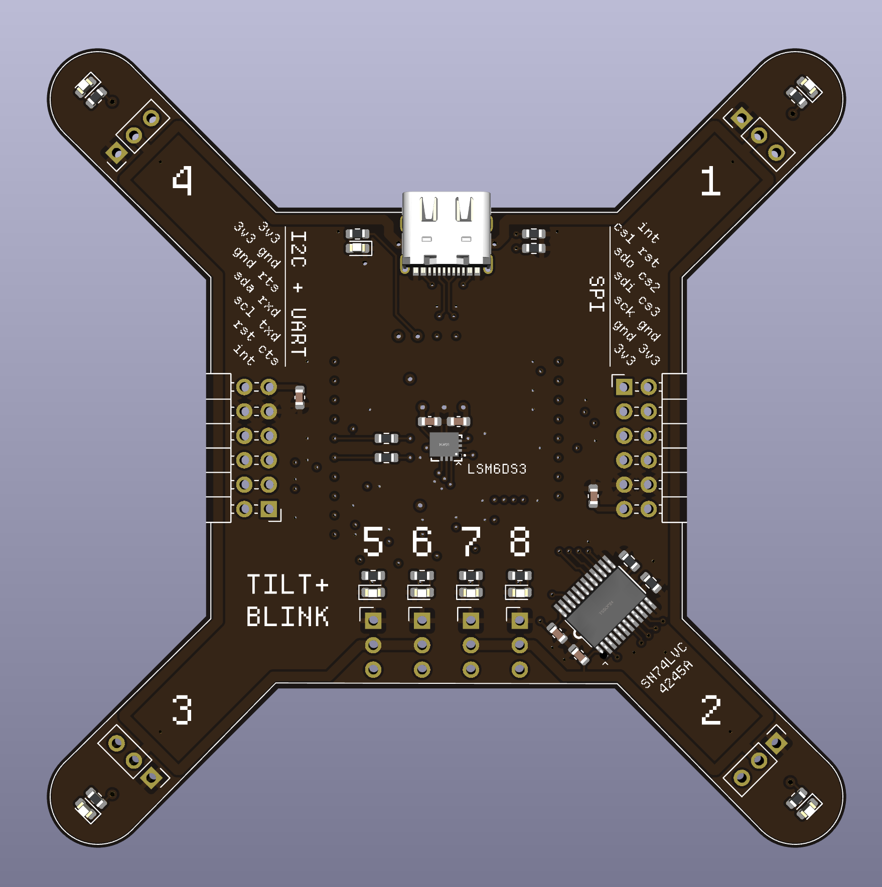

# Demos

These are various demos that are currently used to showcase specific features, and in many cases, act as basic smoke tests that things are still working.

The demos are split into separate cargo workspaces, one per target platform.

Currently, there are demos for:

* `std` - meant to run on typical desktop platforms (win/mac/linux)
* `esp32c6` - Applications for the ESP32-C6 platform, typically using the `ESP32-C6-DevKitC-1`
* `rp2350` - Applications for the RP2350 platform, typically using a `Pico2` development board, with or without a debugger.
* `rp2040` - Applications for the RP2040 platform, typically using a `Pico` development board, with or without a debugger.
* `nrf52840` - Applications for the `nRF52840` platform, typically using an `nRF52840-DK`

## End to End Demos

The following are particularly notable demos:

### USB

These are demos that just ping and post over usb, a simple demo for getting
started as it requires no components besides the microcontroller itself. the
workspaces for these are

- `std/ergot-nusb-router`
- `rp2040/rp2040-eusb` / `rp2350/rp2350-eusb` / `nrf52840/nrf52840-eusb`

### "Tilt App"

The "Tilt App" demo consists of three parts:

* The [`rp2350-tilt`] firmware project, running on an RP2350
* The [`tilt-app`] host project, running on a PC
* The [`shared-icd`] library crate, used by both the firmware and PC projects
* The [`stream-plotting`] project, running on a PC, uses a simple GUI to live-stream the data from the tilt board

[`rp2350-tilt`]: ./rp2350/rp2350-tilt/README.md
[`tilt-app`]: ./std/tilt-app/README.md
[`shared-icd`]: ./shared-icd/README.md
[`stream-plotting`]: ./std/stream-plotting/README.md

The board has an LSM6DS3TR accelerometer + gyroscope, eight PWM output channels, and
an RP2350. This demo has the firmware stream the accelerometer and gyroscope data at
a sample rate of 6.66k samples per second over USB, and also listens for commands to
set the PWM duty cycle of each of the eight channels.

This example is intended to cover the case where an embedded linux system may offload
real-time or i/o tasks to a microcontroller to do things like control a quadrotor
aircraft.
